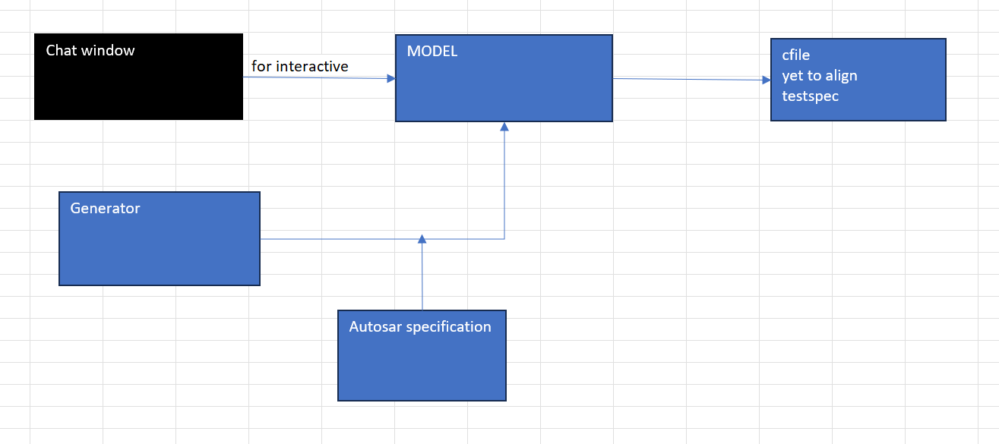

# AUTOSAR_LLM

A private AI-assisted engineering toolkit for automotive software teams working with **AUTOSAR**.

`AUTOSAR_LLM` helps engineers turn requirements into AUTOSAR-aware design and implementation outputs while keeping work local and controlled.

Highlights:

- Requirement-driven automotive code generation
- Support for AUTOSAR Classic and Adaptive workflows
- Specification-grounded engineering outputs
- Safer, more reviewable artifacts for development teams

---

## Project Structure

```

```

---

## Getting Started

Use the local project environment to run the workflow, validate the model, and generate AUTOSAR-related outputs.

---

## AUTOSAR Specification Retrieval

The project uses local AUTOSAR specification context to help keep generated outputs aligned with automotive requirements and engineering standards.
