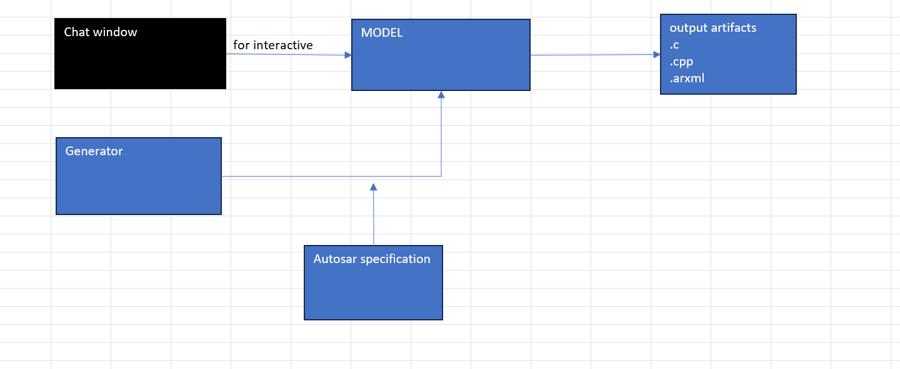
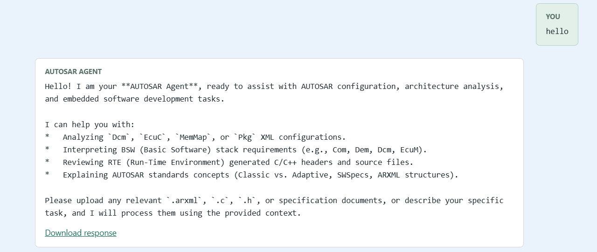

# AUTOSAR_LLM

A private AI-assisted engineering toolkit for automotive teams building and validating **AUTOSAR** software.

`AUTOSAR_LLM` is designed for the real-world case where an engineer has a system requirement, needs a compliant automotive software artifact, and wants a fast, local, reviewable workflow without sending sensitive design data to external services.

Use cases:

- Turn requirement text into automotive-ready code and specification output
- Support AUTOSAR Classic and Adaptive development workflows
- Ground generated results in local AUTOSAR specification context
- Improve speed and consistency for engineering reviews and validation

---

## Project Structure

```
AUTOSAR_LLM/
├── models/
├── .env
├── .gitignore
├── requirements.txt
├── local_engine.py
├── llm_client.py
├── main.py
├── generate_c.py
├── generate_spec.py
├── autosar_spec/
├── saves/
├── output/
├── tests/
└── README.md
```

---

## Getting Started

Use the local project environment to run the workflow, validate the model, and generate AUTOSAR-related outputs.

The model is based on Qwen3.5 9B trained with autosar and is used locally.


---

## AUTOSAR Specification Retrieval

The project uses local AUTOSAR specification context to help keep generated outputs aligned with automotive requirements and engineering standards.

The AUTOSAR R25_11 standard is used as the source context for generation and retrieval-based responses.

## Generation

For interactive use, a generative chat workflow is available to provide input and review model output with option to add file.



## Code generation with specification

```powershell
Generate AUTOSAR Classic C or Adaptive C++ source from a requirement/specification

positional arguments:
  requirement           Natural language automotive requirement string
```
  -o OUTPUT, --output OUTPUT
                        Output path; the filename is prefixed with the inferred or specified component name
  --platform {classic,adaptive}
                        AUTOSAR platform and source language (default: classic/C)
  --component COMPONENT
                        AUTOSAR component name for the generated filename (inferred when omitted)
  --max-tokens MAX_TOKENS
                        Maximum tokens to generate (default: 8192)

Example: python c:\workspace\AUTOSAR_llm_model\generate_spec.py --platform=classic --component canif canif_cfg.h                        
